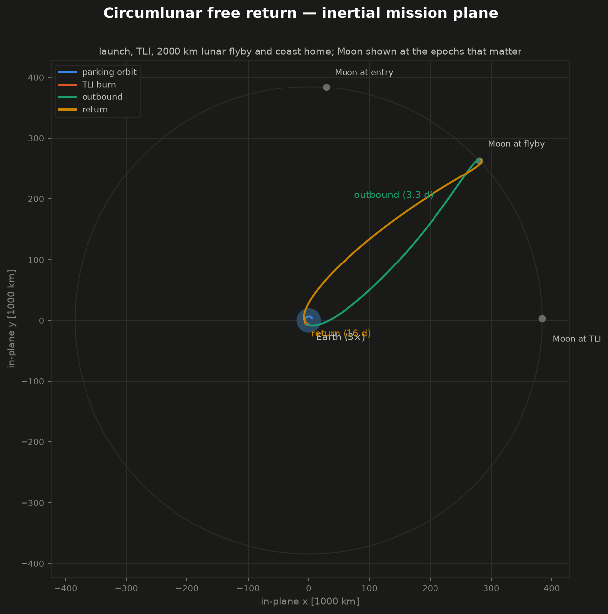
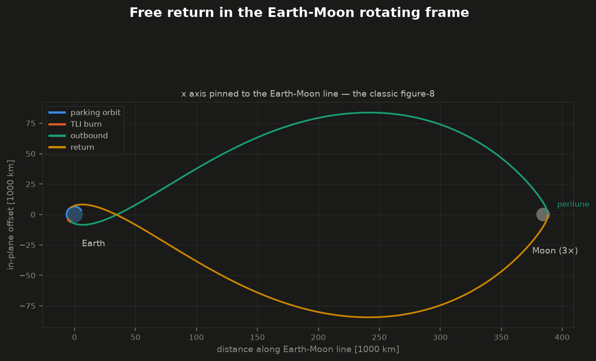

# SatelliteSim.jl (`ss.jl`)

Mid-fidelity, extensible satellite mission simulation in pure Julia
(standard library only — no package dependencies). Two reference missions:

1. **LEO reentry** — an unpropelled pod returning from low Earth orbit to a
   Pacific splashdown off the US west coast (the original v0.1 mission).
2. **Circumlunar free return** (v0.2) — the whole flight: a three-stage
   rocket launches the same pod from a Cape-like site, a tuned gravity-turn
   ascent inserts into a 200 km parking orbit, the kick stage performs a
   finite trans-lunar-injection burn, the pod coasts around the Moon on a
   free-return trajectory (2000 km perilune, no burns after TLI), and comes
   home to a ballistic 10.6 km/s entry and Pacific splashdown.



## The circumlunar mission at a glance

```
launch (57.8 t, 3 stages)  ──►  200 km parking orbit, i = 28.5°
        tuned pitch program        insertion by closed-loop cutoff
                                        │  coast <1 rev
                                        ▼
                       TLI: kick stage, Δv ≈ 3.15 km/s finite burn
                                        │  3.3 d outbound
                                        ▼
                          lunar flyby, perilune 2000 km (free return)
                                        │  ~16 d coast home
                                        ▼
              vacuum perigee 35 km  ──►  EI at 10.6 km/s, Mach 28
                                        │  4-DOF ballistic entry, 18 g
                                        ▼
                          drogue + main chutes, Pacific splashdown
```

Everything is designed by the code, not hand-tuned: the ascent pitch program
is closed by a 2×2 Newton shooting method, the TLI ignition time and Δv are
closed by a patched-conic-seeded Newton iteration on (perilune altitude,
return perigee altitude) with an outer corrector for the multi-day lunar
tide drift, and the whole chain — design included — runs in about a second.



## What the circumlunar chain models

**Launch** (`src/propulsion.jl`, `src/launch.jl`): 3-DOF + mass point
dynamics over the rotating WGS-84 Earth. Stages burn at constant vacuum mass
flow with nozzle-pressure thrust correction; drag uses a Mach-indexed
slender-body CD table on the USSA76 atmosphere. Guidance is the classic
sequence — vertical rise, pitch-over kick toward the launch azimuth, gravity
turn (thrust along the relative wind) through stage 1, then a linear-tangent
pitch law for the upper stages with cutoff at the target orbit energy.
`tune_ascent` closes (pitch0, pitch rate) on (insertion altitude, γ = 0) by
damped-Newton shooting — a stand-in for PEG-class guidance. Staging drops
dry mass, the fairing jettisons at 120 km, and unspent kick-stage propellant
is the TLI budget. The default `Sable` launcher (S1 kerolox 950 kN, S2
kerolox 95 kN, S3 storable 15 kN) puts ~1.4 t through TLI from a 57.8 t
liftoff.

**Trans-lunar injection & free return** (`src/moon.jl`, `src/translunar.jl`):
the Moon is a circular ephemeris in the achieved parking-orbit plane (the
coplanar-launch-window assumption real missions buy with launch timing), and
cislunar flight integrates Earth point-mass + differential lunar gravity
with a step size scheduled by the local dynamical timescale of whichever
body dominates. The TLI burn is finite (prograde thrust on the actual kick
stage; gravity losses are physical, not modeled). `design_free_return`
seeds from a patched conic — transfer apogee past the lunar distance, Kepler
time-of-flight to the crossing, Moon lead angle — scans the encounter window
(1 min of ignition time sweeps the b-plane by ~27,000 km, so the impact zone
and its escape-side and free-return-side flanks are all a few minutes wide),
then Newton-iterates (ignition time, Δv) onto (perilune altitude, return
vacuum perigee), with an outer corrector that absorbs the few-hundred-km
perigee drift the Moon's tides add over the long coast home.

**Entry**: the pod hands off at 140 km to the original 4-DOF reentry
simulation — same vehicle, same aero/heating models — now at 10.6 km/s
instead of 7.6. Tauber–Sutton radiative heating switches itself on above
9 km/s, peak loads reach ~18 g on this ballistic corridor, and the drogue +
main sequence flies unchanged.

Nominal circumlunar numbers (v0.2): TLI Δv 3151 m/s of a 3330 m/s budget,
perilune 2000 ± 30 km, return vacuum perigee 35.5 km (γ ≈ −7.3° at 140 km),
entry peak 17.9 g / 247 W/cm², stagnation heat load 104 MJ/m², splashdown
19.7 days after liftoff at 4.5 m/s under main.

Plots: `output/plots/moonshot_*` — 3D ascent, Earth-Moon trajectory,
rotating-frame figure-8, 3D entry. `scripts/make_viewer.py` builds an
interactive HTML viewer (`output/moonshot_viewer.html`) with mission-time
playback and an inertial/rotating frame toggle.

## What the reentry sim models

**4 degrees of freedom** — 3 translational + 1 rotational (the body pitch
angle):

* Translation is integrated in Earth-centered-inertial Cartesian coordinates
  over a rotating WGS-84 Earth, so aerodynamic forces use the
  atmosphere-relative velocity and splashdown targeting sees Earth rotation.
* The 4th DOF is the body pitch angle, carried as angle-of-attack dynamics:
  `α̇ = q − γ̇`, `Iyy·q̇ = q̄·Sref·Lref·Cm(M, α, q̂)` with Mach-dependent
  static stability `Cm_α(M)` and pitch damping `Cm_q(M)`. The capsule
  genuinely oscillates about trim and damps as dynamic pressure builds —
  see `output/plots/nominal_attitude.png`.

**Entry interface at 120 km** (per the mission spec):

* Above EI — pure orbital mechanics: point-mass gravity + J2 oblateness.
* Below EI — full aerodynamic environment: US Standard Atmosphere 1976
  (analytic layers to 86 km, USSA76 tables to 500 km), Mach-dependent
  blunt-capsule coefficient tables (CD, CL_α, Cm_α, Cm_q from subsonic to
  Mach 30), Sutton–Graves convective + Tauber–Sutton radiative stagnation
  heating, integrated heat load and radiative-equilibrium wall temperature,
  and a drogue + main parachute sequence with finite canopy fill times.

**Events**: EI crossing and splashdown are located by bisection to sub-meter
altitude tolerance; parachute deploys trigger on Mach/altitude gates.

**Deorbit targeting**: `target_deorbit` tunes the deorbit ellipse's RAAN and
argument of perigee by fixed-point iteration on full trajectory simulations
until splashdown hits the target (converges in ~5–6 runs to a few km).

**Monte Carlo**: threaded dispersion analysis over vehicle mass (the "mass
above or below target" case), drag coefficient, pitch stiffness, trim angle
(CG offset), atmospheric density, deorbit-burn state errors, initial
attitude, and parachute drag areas — with footprint statistics (CEP, R95,
1σ covariance ellipse).

## Nominal results (v0.1 reference mission)

350 kg, 1.5 m diameter pod (β ≈ 130 kg/m²), deorbit ellipse 400 × 25 km,
i = 51.6°, targeted at 32.5°N 121.5°W:

| Quantity | Value |
|---|---|
| Entry interface state | 7.60 km/s, γ = −1.46°, Mach 20 |
| Downrange EI → splash | ~2 930 km |
| Peak deceleration | 7.1 g |
| Peak stagnation heating | 45 W/cm² at 63 km (T_wall ≈ 1750 K) |
| Stagnation heat load | 77 MJ/m² |
| Drogue → main → splashdown | 9 km → 3 km → 4.5 m/s |
| Nominal miss | 2.5 km |
| MC footprint (300 samples) | 1σ ellipse 363 × 12 km along-track, CEP 228 km |

The long thin footprint is the correct physics of a *shallow unguided
ballistic* entry: downrange is very sensitive to density/CD/mass at
γ_EI ≈ −1.5°. Steepen the entry (lower `periapsis_alt` in
`DeorbitElements`) to trade footprint size against g-load and heating, or
add a lift-modulation guidance law (see extension points) to shrink it by
orders of magnitude.

Plots: `output/plots/` — flight profile, aerothermal environment, pitch-DOF
behavior, ground track, MC footprint and statistics.

## Running

Julia ≥ 1.9. The core has **zero external dependencies**.

```bash
# tests (80 assertions: atmosphere vs USSA76 tables, vis-viva, J2, heating,
# orbit propagation, Tsiolkovsky, ephemeris, ascent-to-orbit, the full
# circumlunar chain, and end-to-end reentry)
julia --project -e 'push!(LOAD_PATH, "src"); using SatelliteSim; include("test/runtests.jl")'

# targeted nominal trajectory -> output/*.csv
julia --project scripts/run_nominal.jl

# full circumlunar mission (design + fly) -> output/moonshot_*.csv
julia --project scripts/run_moonshot.jl

# Monte Carlo (threaded) -> output/montecarlo.csv + summary
julia --project -t auto scripts/run_montecarlo.jl 300

# plots
python3 scripts/make_plots.py        # reentry plots (matplotlib)
python3 scripts/make_3d.py           # circumlunar 3D/mission-plane plots
python3 scripts/make_viewer.py       # interactive HTML mission viewer
julia --project scripts/make_plots.jl  # requires Plots.jl installed

# mission-control panel: configure, run, and explore in the browser
julia --project -t auto scripts/panel.jl   # then open http://localhost:8137
```

### Mission-control panel

`scripts/panel.jl` serves a local cockpit (pure stdlib — a raw-`Sockets`
HTTP server, no dependencies): edit the mission targets and all three
stages' propellant/dry mass/thrust/Isp, hit **Run**, and get the full
design + flight back in about a second — stat tiles, the interactive 3D
trajectory with mission-time playback and an inertial/rotating frame
toggle, ascent & entry profile charts, the event timeline, and a run
history for side-by-side comparison. A **parameter sweep** tab varies any
knob across a range (threaded; ~50 missions/min) and plots the outcome
curve — e.g. sweeping pod mass shows the TLI propellant margin hitting
zero just above 400 kg, which is the actual payload limit of the default
launcher. Runs that fly but miss the requested perilune/perigee (e.g. a
prop-starved TLI) are flagged **off target** rather than silently plotted.

Programmatic use:

```julia
push!(LOAD_PATH, "src"); using SatelliteSim

scn, el, _ = west_coast_scenario()        # targeted reference mission
res = simulate(scn)                        # SimResult: log, events, metrics
print_summary(res, scn)

samples = run_montecarlo(scn, Dispersions(mass_frac = 0.05); n = 500)
mc_statistics(samples)

ms = moonshot()                            # design + fly the lunar mission
print_moonshot_summary(ms)
ms.ascent.elements                         # parking-orbit insertion
ms.cislunar.perilune_alt                   # 2000 km
ms.entry.peak_gload                        # ~18 g

# pieces are usable on their own:
lv = default_moon_rocket()
guid, asc = tune_ascent(lv, AscentGuidance(h_target = 250e3))
eph = coplanar_moon(asc.r, asc.v)
```

## Architecture

```
src/
  SatelliteSim.jl   module root & exports
  constants.jl      physical/planetary constants (Earth + Moon)
  vec3.jl           allocation-free 3-vector helpers
  atmosphere.jl     AbstractAtmosphere: USSA76, ScaledAtmosphere
  gravity.jl        AbstractGravity: PointMass, J2, ThirdBody, Composite
  frames.jl         ECI/ECEF/WGS-84 geodetic, Kepler elements <-> states, ENU
  aerodynamics.jl   Mach-interpolated capsule coefficient tables
  vehicle.jl        Vehicle + Parachute definitions
  heating.jl        Sutton-Graves, Tauber-Sutton, wall temperature
  dynamics.jl       4-DOF equations of motion + phase logic (EI at 120 km)
  integrator.jl     RK4 (phase-scheduled step sizes)
  propulsion.jl     Stage / LaunchVehicle, pressure-corrected thrust
  moon.jl           circular lunar ephemeris (mission-plane construction)
  launch.jl         3-DOF+mass ascent, staging, guidance, Newton tuning
  translunar.jl     cislunar propagation, finite TLI burn, free-return design
  simulation.jl     entry driver: events, bisection, logging
  scenarios.jl      deorbit design + splashdown targeting
  mission.jl        the full launch->Moon->splashdown chain (moonshot)
  montecarlo.jl     dispersions, threaded MC, footprint statistics
  output.jl         CSV writers, console summaries
```

### Extension points (built in on purpose)

| Goal | How |
|---|---|
| Different rockets | build a `LaunchVehicle` from `Stage`s; `tune_ascent` re-closes the pitch program for any stack that can reach orbit |
| Faster (Apollo-class) returns | add a third design parameter (e.g. burn direction or a mid-course trim) and target flight time alongside perilune/perigee in `design_free_return` |
| Real lunar ephemeris | any callable `t -> V3` plugs into `ThirdBodyGravity` and `fly_cislunar`; swap `CircularMoonEphemeris` for DE-series data to get eccentricity + plane evolution |
| Out-of-plane launch windows | replace `coplanar_moon` with a real ephemeris + a plane-targeting layer on `AscentGuidance.azimuth` and launch time |
| Sun perturbation | append another `ThirdBodyGravity` to the cislunar acceleration |
| Better atmosphere | subtype `AbstractAtmosphere` (NRLMSISE-00, GRAM dispersions, Mars…) |
| Richer aero | subtype `AbstractAeroDatabase` with full (Mach, α) CN/CA/Cm maps |
| Entry guidance | wrap `simulate` — `bank` and trim α (`cl_trim`) are the control channels a bank-angle guidance law would command; a lifting entry shrinks the 18 g lunar-return load dramatically |
| 6-DOF | the pitch channel is isolated in `dynamics.jl`; adding roll/yaw states extends the same pattern |
| Higher-order integration | swap `rk4_step!` behind the same signature |
| Mission Monte Carlo | disperse `Stage` performance, TLI execution errors, and ephemeris phase through `moonshot` the same way `run_montecarlo` disperses entry |

### Fidelity notes & current limits

* The pitch DOF uses the planar (pitch-plane) formulation coupled to the 3D
  translational state via γ̇ — valid while heading changes slowly, which
  holds for entry; a full 6-DOF quaternion model is the upgrade path.
* Above ~86 km, "Mach" and continuum aero coefficients are bookkeeping
  conveniences (free-molecular regime); forces there are negligible anyway.
* Radiative heating is ~0 below 9 km/s (LEO return) by construction of the
  Tauber–Sutton correlation; it activates automatically for faster entries
  (and does, at 10.6 km/s on the lunar return).
* Earth rotation angle starts at 0 by convention; longitudes are consistent
  internally (targeting absorbs the choice).
* The LEO-reentry scenario starts on the post-deorbit-burn coast ellipse;
  the circumlunar mission models all burns explicitly.
* The lunar model is a circular, coplanar ephemeris: right for designing and
  flying the free-return class, but real launch windows, the Moon's 5.1°
  plane and ±21,000 km eccentricity, and solar perturbation belong to the
  ephemeris upgrade (see extension points).
* The designed free return is the slow, near-minimum-energy family (3.3 d
  out, ~16 d home). Apollo flew a faster, higher-energy family — reachable
  here by adding flight time as a third design target.
* Splashdown of the lunar return lands wherever the geometry says; targeting
  a specific site couples TLI epoch to Earth rotation and is a
  straightforward outer loop that is not yet closed.
