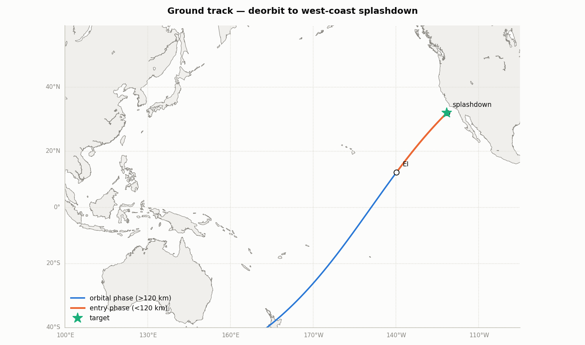

# SatelliteSim.jl (`ss.jl`)

Mid-fidelity, extensible satellite mission simulation in pure Julia
(standard library only — no package dependencies). The current mission is an
**unpropelled reentry pod returning from low Earth orbit to a Pacific
splashdown off the US west coast**, but the architecture is deliberately
built to grow into launch, mid-course, and multi-body mission phases.



## What it models

**4 degrees of freedom** — 3 translational + 1 rotational (the body pitch
angle):

* Translation is integrated in Earth-centered-inertial Cartesian coordinates
  over a rotating WGS-84 Earth, so aerodynamic forces use the
  atmosphere-relative velocity and splashdown targeting sees Earth rotation.
* The 4th DOF is the body pitch angle, carried as angle-of-attack dynamics:
  `α̇ = q − γ̇`, `Iyy·q̇ = q̄·Sref·Lref·Cm(M, α, q̂)` with Mach-dependent
  static stability `Cm_α(M)` and pitch damping `Cm_q(M)`. The capsule
  genuinely oscillates about trim and damps as dynamic pressure builds —
  see `output/plots/nominal_attitude.png`.

**Entry interface at 120 km** (per the mission spec):

* Above EI — pure orbital mechanics: point-mass gravity + J2 oblateness.
* Below EI — full aerodynamic environment: US Standard Atmosphere 1976
  (analytic layers to 86 km, USSA76 tables to 500 km), Mach-dependent
  blunt-capsule coefficient tables (CD, CL_α, Cm_α, Cm_q from subsonic to
  Mach 30), Sutton–Graves convective + Tauber–Sutton radiative stagnation
  heating, integrated heat load and radiative-equilibrium wall temperature,
  and a drogue + main parachute sequence with finite canopy fill times.

**Events**: EI crossing and splashdown are located by bisection to sub-meter
altitude tolerance; parachute deploys trigger on Mach/altitude gates.

**Deorbit targeting**: `target_deorbit` tunes the deorbit ellipse's RAAN and
argument of perigee by fixed-point iteration on full trajectory simulations
until splashdown hits the target (converges in ~5–6 runs to a few km).

**Monte Carlo**: threaded dispersion analysis over vehicle mass (the "mass
above or below target" case), drag coefficient, pitch stiffness, trim angle
(CG offset), atmospheric density, deorbit-burn state errors, initial
attitude, and parachute drag areas — with footprint statistics (CEP, R95,
1σ covariance ellipse).

## Nominal results (v0.1 reference mission)

350 kg, 1.5 m diameter pod (β ≈ 130 kg/m²), deorbit ellipse 400 × 25 km,
i = 51.6°, targeted at 32.5°N 121.5°W:

| Quantity | Value |
|---|---|
| Entry interface state | 7.60 km/s, γ = −1.46°, Mach 20 |
| Downrange EI → splash | ~2 930 km |
| Peak deceleration | 7.1 g |
| Peak stagnation heating | 45 W/cm² at 63 km (T_wall ≈ 1750 K) |
| Stagnation heat load | 77 MJ/m² |
| Drogue → main → splashdown | 9 km → 3 km → 4.5 m/s |
| Nominal miss | 2.5 km |
| MC footprint (300 samples) | 1σ ellipse 363 × 12 km along-track, CEP 228 km |

The long thin footprint is the correct physics of a *shallow unguided
ballistic* entry: downrange is very sensitive to density/CD/mass at
γ_EI ≈ −1.5°. Steepen the entry (lower `periapsis_alt` in
`DeorbitElements`) to trade footprint size against g-load and heating, or
add a lift-modulation guidance law (see extension points) to shrink it by
orders of magnitude.

Plots: `output/plots/` — flight profile, aerothermal environment, pitch-DOF
behavior, ground track, MC footprint and statistics.

## Running

Julia ≥ 1.9. The core has **zero external dependencies**.

```bash
# tests (49 assertions: atmosphere vs USSA76 tables, vis-viva, J2, heating,
# orbit-propagation accuracy, full end-to-end reentry)
julia --project -e 'push!(LOAD_PATH, "src"); using SatelliteSim; include("test/runtests.jl")'

# targeted nominal trajectory -> output/*.csv
julia --project scripts/run_nominal.jl

# Monte Carlo (threaded) -> output/montecarlo.csv + summary
julia --project -t auto scripts/run_montecarlo.jl 300

# plots (either)
python3 scripts/make_plots.py        # matplotlib (+ basemap for coastlines)
julia --project scripts/make_plots.jl  # requires Plots.jl installed
```

Programmatic use:

```julia
push!(LOAD_PATH, "src"); using SatelliteSim

scn, el, _ = west_coast_scenario()        # targeted reference mission
res = simulate(scn)                        # SimResult: log, events, metrics
print_summary(res, scn)

samples = run_montecarlo(scn, Dispersions(mass_frac = 0.05); n = 500)
mc_statistics(samples)
```

## Architecture

```
src/
  SatelliteSim.jl   module root & exports
  constants.jl      physical/planetary constants
  vec3.jl           allocation-free 3-vector helpers
  atmosphere.jl     AbstractAtmosphere: USSA76, ScaledAtmosphere
  gravity.jl        AbstractGravity: PointMass, J2, ThirdBody, Composite
  frames.jl         ECI/ECEF/WGS-84 geodetic, Kepler elements, ENU, haversine
  aerodynamics.jl   Mach-interpolated capsule coefficient tables
  vehicle.jl        Vehicle + Parachute definitions
  heating.jl        Sutton-Graves, Tauber-Sutton, wall temperature
  dynamics.jl       4-DOF equations of motion + phase logic (EI at 120 km)
  integrator.jl     RK4 (phase-scheduled step sizes)
  simulation.jl     driver: events, bisection, logging
  scenarios.jl      deorbit design + splashdown targeting
  montecarlo.jl     dispersions, threaded MC, footprint statistics
  output.jl         CSV writers, console summaries
```

### Extension points (built in on purpose)

| Goal | How |
|---|---|
| Launch / mid-course burns | `Scenario.extra_accel(r, v, t)` — return thrust acceleration; phases already integrate in ECI Cartesian so no reformulation is needed |
| Moon/Sun perturbations | implement an ephemeris `t -> V3` and add `ThirdBodyGravity(mu, eph)` to a `CompositeGravity` |
| Better atmosphere | subtype `AbstractAtmosphere` (NRLMSISE-00, GRAM dispersions, Mars…) |
| Richer aero | subtype `AbstractAeroDatabase` with full (Mach, α) CN/CA/Cm maps |
| Guidance | wrap `simulate` — `bank` and trim α (`cl_trim`) are the control channels a bank-angle guidance law would command |
| 6-DOF | the pitch channel is isolated in `dynamics.jl`; adding roll/yaw states extends the same pattern |
| Higher-order integration | swap `rk4_step!` behind the same signature |

### Fidelity notes & current limits

* The pitch DOF uses the planar (pitch-plane) formulation coupled to the 3D
  translational state via γ̇ — valid while heading changes slowly, which
  holds for entry; a full 6-DOF quaternion model is the upgrade path.
* Above ~86 km, "Mach" and continuum aero coefficients are bookkeeping
  conveniences (free-molecular regime); forces there are negligible anyway.
* Radiative heating is ~0 below 9 km/s (LEO return) by construction of the
  Tauber–Sutton correlation; it activates automatically for faster entries.
* Earth rotation angle starts at 0 by convention; longitudes are consistent
  internally (targeting absorbs the choice).
* No propulsion, per the mission: the sim starts on the post-deorbit-burn
  coast ellipse.
